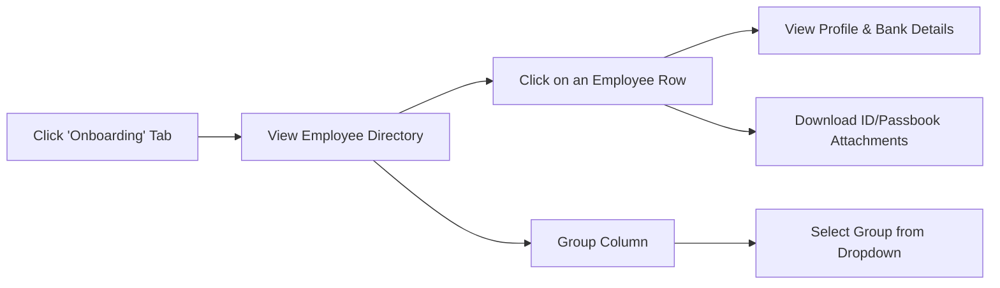
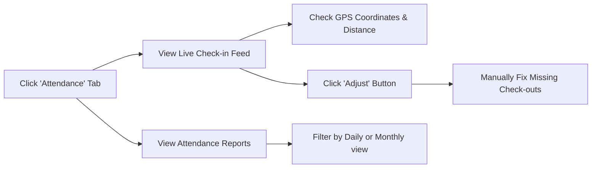
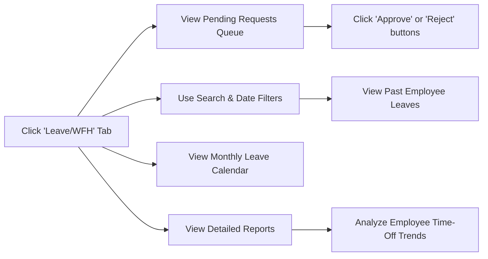
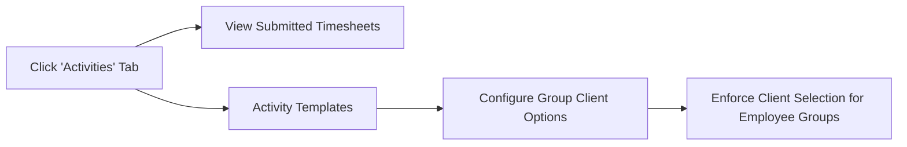
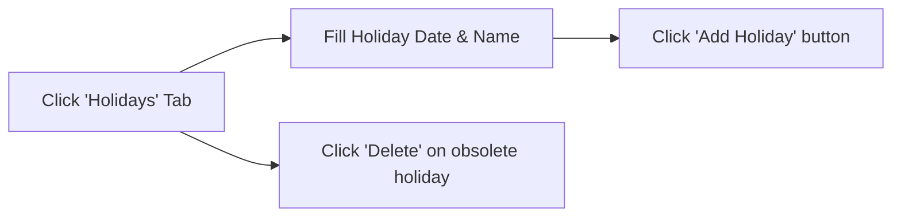
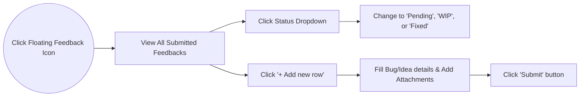
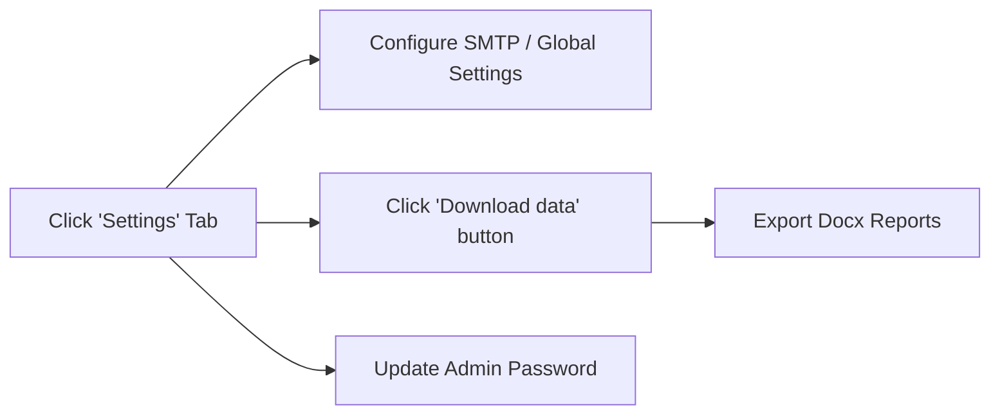

# Admin User Guide

Welcome to the HRMS Admin Portal. This comprehensive guide outlines all the functionalities available to Administrative users.

## 1. Dashboard Overview
Upon logging in, the Admin Dashboard provides a high-level summary of the organization's daily metrics:
- **Active Employees**: Total number of registered active employees.
- **Total Attendance**: Number of check-ins recorded for the day.
- **Total Activities**: Total number of activity reports logged.
- **Quick Navigation**: Tabbed interface to switch between Onboarding, Attendance, Leave/WFH, Activities, Holidays, and Settings.

## 2. Onboarding & Directory (`Onboarding` Tab)

Manage employee profiles, onboarding details, and group assignments.
- **Employee Directory**: A searchable table listing all employees (Name, ID, Email, Department, Group, Office Location).
- **Profile Review**: Click on any employee to view their detailed profile, including basic info and submitted onboarding data (Personal details, Bank info, Address).
- **Attachment Review**: Review and download securely uploaded onboarding documents (ID proofs, passbooks, etc.).
- **Group Management**: Group employees into specific categories (e.g., Development, Marketing) to assign customized activity templates or workflows.

## 3. Attendance Management (`Attendance` Tab)

Monitor and manage daily check-ins for all employees.
- **Live Attendance Feed**: View real-time check-in and check-out logs for all employees.
- **Attendance Reports**: View comprehensive daily or monthly attendance reports for all employees. Filter by specific dates or months to analyze workforce trends.
- **Location Tracking**: Check-in records display the geographical coordinates (Latitude/Longitude).
- **Geofencing / Office Distance**: If an office location is set for an employee, their check-in record will display their exact distance (in meters) from the designated office coordinate to verify physical presence.
- **Manual Adjustments**: Admins can manually adjust or override attendance records for employees (e.g., if an employee forgets to check out).

## 4. Leave & Work From Home (WFH) (`Leave/WFH` Tab)

Manage all incoming time-off requests.
- **Request Processing**: View a queue of Pending Leave and WFH requests. Admins can `Approve` or `Reject` these requests directly.
- **Comprehensive Reports**: Access detailed leave and WFH reports. Generate insights across different time periods and filter down to specific employees.
- **Calendar View**: A visual monthly calendar displaying approved Leave and WFH days for all active employees.
- **Search & Filters**: Quickly filter past or pending requests by specific employees or date ranges.
- **Auto-Approval**: Admins can configure settings to automatically approve Leave or WFH requests to streamline workflows.

## 5. Activity & Productivity (`Activities` Tab)

Track daily task submissions and configure project templates.
- **Activity Logs**: View submitted activity reports from employees, including hours spent, client/project picked, and detailed task descriptions.
- **Activity Templates**: Create and enforce structured templates for employees. 
- **Group Client Options**: Assign specific predefined "Client Options" or "Projects" to different employee groups. Employees in those groups will only be able to select from those assigned options when submitting their activity.

## 6. Holiday Management (`Holidays` Tab)

Maintain the corporate holiday calendar.
- **Add Holidays**: Define new upcoming holidays (Date and Name).
- **Remove Holidays**: Delete obsolete or incorrect holidays.
- **Visibility**: These holidays automatically sync to the Employee dashboard so they are globally aware of off-days.

## 7. Feedback & Suggestions Tracker

A dedicated space to track and resolve internal system feedback.
- **View All Feedbacks**: An Excel-like grid showing all submitted feedback from employees, including the page they submitted it from.
- **Status Updates**: Admins have exclusive access to change a feedback's status (`Pending`, `WIP`, `Fixed`).
- **Add New Feedback**: Admins can also log bugs or suggestions manually on behalf of users, complete with file attachments.

## 8. Settings & Configurations (`Settings` Tab)

Global portal controls and data management.
- **Email Configurations**: Setup SMTP details to enable automated email logs and password reset emails.
- **Company Settings**: Toggle global features (e.g., Auto-approval for Leaves).
- **Data Export**: Admins can download employee data logs directly as Docx files.
- **Change Password**: Securely update the administrator password.
