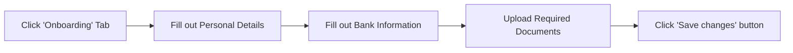
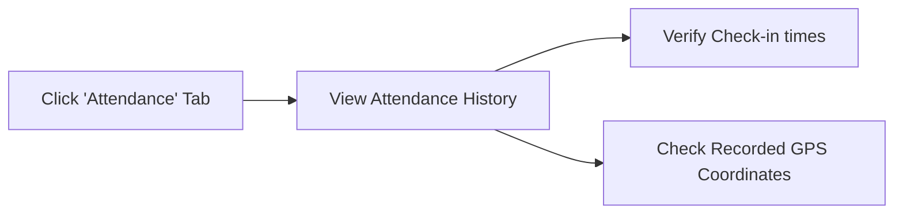
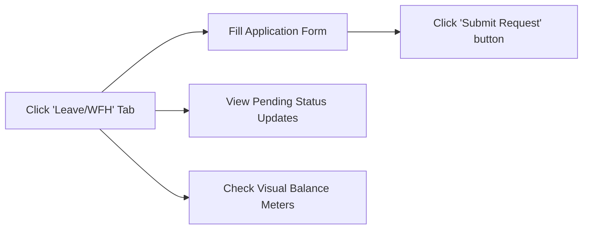
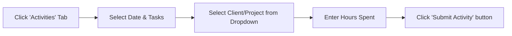
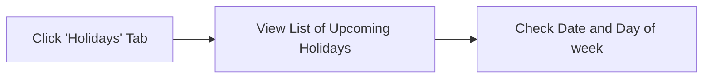
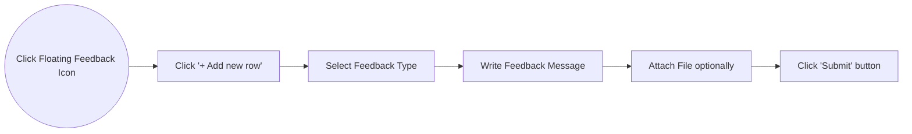

# Employee User Guide

Welcome to the HRMS Employee Portal. This guide outlines all the functionalities available to you to manage your day-to-day HR tasks.

## 1. Dashboard & Quick Actions
Upon logging in, your dashboard gives you immediate access to your essential daily actions.
- **Quick Check-In / Check-Out**: Easily log your start and end times for the day. If geofencing is enabled, your location will be verified against your assigned office coordinate.
- **Visual Balances**: View your remaining Leave and Work From Home (WFH) balances immediately on the dashboard through intuitive visual meters.
- **Quick Navigation**: Use the top tabs to switch between Onboarding, Attendance, Leave/WFH, Activities, and Holidays.

## 2. Profile & Onboarding (`Onboarding` Tab)

Manage your personal and professional information securely.
- **Profile Overview**: View your current recorded details, assigned department, and group.
- **Submit Onboarding Details**: If you are a new joiner, you will be prompted to fill out structured onboarding forms.
- **Information Upload**: Securely submit personal details, bank information, emergency contacts, and upload required verification documents directly to the portal.
- **Read-only Status**: Once submitted, your profile is locked for review by the Admin team to ensure data integrity.

## 3. Attendance Log (`Attendance` Tab)

Keep track of your daily office hours and check-in history.
- **Attendance History**: View a chronological list of all your past check-in and check-out logs.
- **Location Status**: Verify that your recorded coordinates matched the office location successfully.

## 4. Leave & Work From Home (WFH) (`Leave/WFH` Tab)

Apply for and track your time off.
- **Application Form**: Submit requests for upcoming Leave or WFH days directly.
- **Live Balances**: Track your consumed and remaining quotas for the year.
- **Status Tracking**: See the real-time status of your requests (`Pending`, `Approved`, `Rejected`).
- **Calendar View**: View your personal monthly calendar to see exactly which days you have approved time off.

## 5. Activity Tracker (`Activities` Tab)

Log your daily productivity and tasks.
- **Structured Timesheets**: Submit detailed activity entries breaking down the hours spent on specific tasks.
- **Client & Project Selection**: If your admin has assigned you to a specific group, you will see a tailored dropdown menu of clients or projects to bill your time against.
- **Activity History**: View a log of all your previously submitted task reports.

## 6. Corporate Holidays (`Holidays` Tab)

Stay informed about upcoming non-working days.
- **Holiday Calendar**: View a complete, updated list of all corporate holidays for the current year, managed by the Admin.

## 7. Feedback & Suggestions Tracker

Help improve the portal and company processes.
- **Submit Feedback**: Click the floating Feedback icon to open the tracker. You can log a bug, suggest an improvement, or ask a question.
- **Upload Attachments**: Add screenshots or documents to your feedback to provide clear context.
- **Track Status**: View a list of all your previously submitted feedbacks and track their resolution status (`Pending`, `WIP`, `Fixed`).
